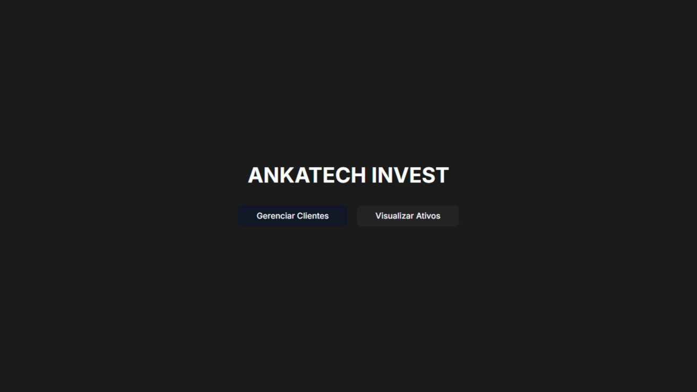

# Gerenciamento de Clientes e Ativos Financeiros

## 🚀 Visão geral do projeto



Este repositório contém a implementação de uma aplicação para um escritório de investimentos, focada no gerenciamento de clientes e na visualização de informações básicas de ativos financeiros. A arquitetura é baseada em um monorepo, utilizando Docker Compose para orquestrar os serviços de backend, frontend e banco de dados.

O principal objetivo é demonstrar a capacidade de construir e integrar uma aplicação full-stack moderna, com foco em:
- Gerenciamento de clientes (CRUD).
- Exibição e manipulação de ativos financeiros por cliente.
- Implementação 100% em TypeScript.
- Orquestração de ambiente de desenvolvimento com Docker.

## 🛠️ Tecnologias utilizadas

### Backend
- **Node.js**: Ambiente de execução.
- **Fastify**: Framework web rápido e de baixo overhead.
- **Prisma ORM**: ORM moderno para interação com o banco de dados.
- **TypeScript**: Linguagem de programação.
- **Zod**: Validação de schemas e payloads.

### Frontend
- **Next.js**: Framework React para aplicações web (App Router).
- **React**: Biblioteca JavaScript para interfaces de usuário.
- **ShadCN UI**: Componentes de UI reutilizáveis e personalizáveis.
- **React Query (TanStack Query)**: Gerenciamento de estado de servidor e cache de dados.
- **React Hook Form**: Gerenciamento e validação de formulários.
- **Axios**: Cliente HTTP para requisições à API.
- **Tailwind CSS**: Framework CSS utilitário para estilização.
- **Lucide React**: Biblioteca de ícones.

### Infraestrutura & Ferramentas
- **Docker**: Containerização de serviços.
- **Docker Compose**: Orquestração de múltiplos contêineres.
- **MySQL (v8.0)**: Banco de dados relacional.
- **WSL 2 (Windows Subsystem for Linux 2)**: Backend recomendado para Docker Desktop no Windows.

## 🚀 Como rodar o projeto

Siga os passos abaixo para configurar e subir a aplicação em seu ambiente local.

### Pré-requisitos

Certifique-se de ter as seguintes ferramentas instaladas em sua máquina:
- [**Docker Desktop**](https://www.docker.com/products/docker-desktop) (com WSL 2 configurado no Windows)
- [**Node.js**](https://nodejs.org/en/download/) (versão 18.x ou superior recomendada)
- **npm** (gerenciador de pacotes, geralmente vem com o Node.js) ou **Yarn**

### 1. Clonar o repositório

```
git clone <URL_DO_SEU_REPOSITORIO>
```
```
cd ankatech_case/apps/ # Certifique-se de estar na raíz do monorepo (onde está o docker-compose.yml)
```

### 2\. Configurar variáveis de ambiente

Crie um arquivo `.env.docker` na raiz do monorepo com o seguinte conteúdo:

```
MYSQL_ROOT_PASSWORD=your_secure_password_here # Senha para o usuário 'root' do MySQL. 
```
```
MYSQL_DATABASE=investdb # Nome do banco de dados a ser criado.
```
```
DATABASE_URL="mysql://root:your_secure_password_here@db:3306/investdb"
```
```
NEXT_PUBLIC_BACKEND_URL=http://backend:4000 
```

**Atenção**: Você pode alterar `your_secure_password_here` e `investdb` para seus valores desejados.

### 3\. Subir os serviços com Docker Compose

Este comando vai construir as imagens (backend e frontend), criar o banco de dados, aplicar as migrações e iniciar todos os serviços.

```bash
docker-compose up --build -d
```

Aguarde alguns minutos para que todos os serviços estejam "Up" e "Healthy" (especialmente o banco de dados).

#### 3.1\. Carregar dados iniciais

Após a aplicação estar "Up" e os contêineres inicializados, o banco de dados (`db` service) será populado automaticamente com os dados do `dump_investdb.sql` na sua primeira inicialização (quando o volume `db_data` estiver vazio).

Você pode verificar se o dump foi carregado acessando o frontend (`http://localhost:3000/clients`) e vendo os clientes na lista ou pode fazer isso via postman (`http://localhost:4000/clients`).

**Observação:** Se você precisar forçar a recarga dos dados do dump (por exemplo, após testes ou se o banco estiver com dados diferentes), você deve primeiro remover o volume de dados do banco e então subir o Docker Compose novamente.

1.  **Remover o volume de dados do banco (APAGARÁ TODOS OS DADOS ATUAIS!):**
    ```bash
    docker-compose down -v
    ```
2.  **Subir os serviços novamente (o dump será carregado na inicialização do DB):**
    ```bash
    docker-compose up --build -d
    ```

### 4\. Acessar a aplicação

Após todos os serviços estarem rodando:

-   **Backend API**: `http://localhost:4000` (Use o Postman para testar os endpoints)
-   **Frontend App**: `http://localhost:3000` (Abra no seu navegador)


🔌 Documentação da API (Postman)
--------------------------------

Você pode encontrar a coleção do Postman para testar todos os endpoints da API indo em:

-   **`/docs/Invest.postman_collection.json`**

Para importá-la para o Postman, siga as instruções de importação de coleção.

* * * * *